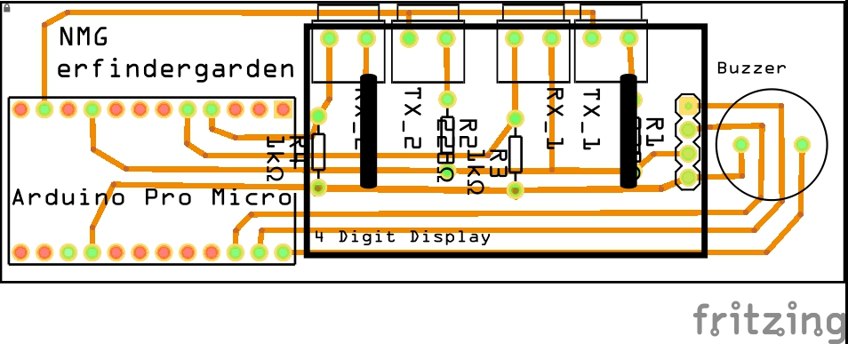

# Nerf Mündungsgeschwindigkeit #

Nachdem ich die Nerf Rayven mit zwei zusätzlichen Batterien ausgestattet habe, wollte ich wissen wie schnell sie jetzt feuert. Dazu habe ich eine Messgerät mit zwei Lichtschranken entwickelt. Die Lichtschranken werden in zwei Ringen auf ein Aufputzrohr mit 32 mm Durchmesser aufgeschoben. Der Abstand der Messpunkte liegt bei 15 cm. Gemessen wird das ganze mit Hilfe eines Arduinos. Die Geschwindigkeit wird auf einem 7-Segment Display angezeigt und ein Tonsignal signalisiert die Messung.

Die Elektronik ist in einer Steuereinheit verbaut und wird zwischen die beiden Messpunkte auf das Rohr geklemmt. Die Stromversorgung erfolgt über USB.

# Design #

Mit Google SketchUp im www.erfindergarden.de

# Elektronik #

Mit Fritzing designt und mit einer Othermill die Platine gefräst.

# Programm #

Das Programm läuft auf einem ARDUINO Pro Micro.

